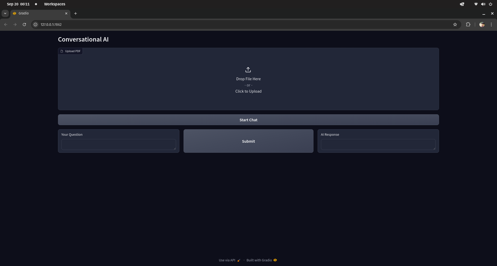
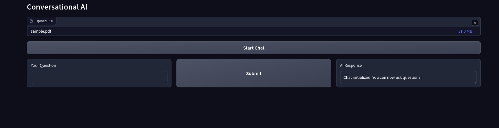
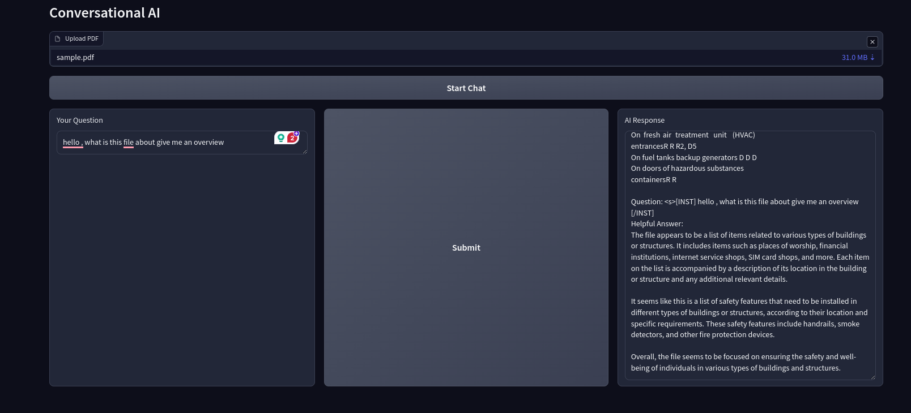
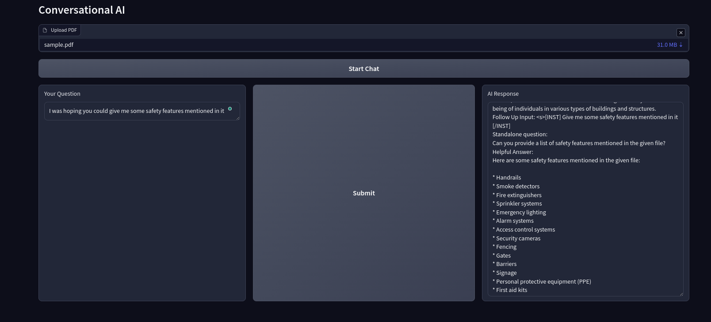

# Gradio-based Conversational PDF Processing

This project demonstrates how to create a conversational AI interface that processes PDFs and enables retrieval-based question answering using large language models (LLMs). It uses **Gradio** for the user interface, **LangChain** for text processing and retrieval, and **Qdrant** as the vector store.

## Table of Contents
- [Features](#features)
- [Project Demo](#project-demo)
- [Setup Instructions](#setup-instructions)
  - [Prerequisites](#prerequisites)
  - [Environment Variables](#environment-variables)
  - [Running the Project](#running-the-project)
- [How It Works](#how-it-works)
- [Customization](#customization)
- [Notes](#notes)
---

## Features
- **PDF Parsing**: Extracts text from uploaded PDF files using `PyPDF2`.
- **Text Chunking**: Splits long text into manageable chunks using `LangChain` for better processing.
- **Conversational Retrieval**: Uses a vector database (Qdrant) to store embeddings and allows for conversational query retrieval.
- **LLM Integration**: Includes HuggingFace transformers for natural language understanding and response generation.
- **Gradio Interface**: Provides a user-friendly interface for interacting with the system.

## Project Demo
Here’s a demo of the Gradio interface and how it looks when interacting with the project:






In this demo:
1. The user uploads a PDF file via the interface.
2. The system extracts the text and splits it into chunks.
3. The user can then ask questions about the content of the PDF, and the system responds using the conversational AI model.

---

## Setup Instructions

### Prerequisites
Before running the notebook, ensure you have the following installed:
- `Python==3.9.18`
- `gradio`
- `dotenv`
- `PyPDF2`
- `langchain`
- `sentence_transformers==2.2.2`
- `qdrant_client`
- `torch==2.2.0`
- `transformers==4.37.0`

You can install the required libraries by running:

```bash
pip install pip install torch==2.2.0 autoawq==0.2.3 sentence-transformers==2.2.2 InstructorEmbedding==1.0.1 transformers==4.37.0 gradio python-dotenv PyPDF2 langchain  qdrant-client transformers
```

### Environment Variables
This project loads environment variables (e.g., API keys, endpoints) from a `.env` file. Create a `.env` file in the root directory and add the required values:

```
HUGGINGFACEHUB_API_TOKEN="your_api_key_here"
PINECONE_HOST = "your_host_site"
PINECONE_API_KEY="your_api_key_here"
QDRANT_API_KEY="your_api_key_here"
QDRANT_HOST="your_host_site"
```

### Running the Project
Once dependencies are installed, you can run the notebook or convert it into a Python script. If using the notebook, ensure the environment variables are set.

1. Open the notebook and run all the cells.
2. Upload a PDF file via the Gradio interface.
3. Interact with the AI by asking questions related to the PDF content.

---

## How It Works

1. **Upload a PDF**: The system parses the document and splits the text into manageable chunks.
2. **Embedding Creation**: Text chunks are converted into embeddings using a model from HuggingFace's `SentenceTransformers`.
3. **Conversational Retrieval**: Queries are processed and matched with relevant text chunks from the vector store (Qdrant), and a large language model generates a response.
4. **Real-time Interaction**: Users can interact with the AI in a conversational manner to retrieve specific information from the uploaded PDF.

---

## Customization
- **Model Customization**: You can switch out the HuggingFace model for another LLM that fits your needs.
- **Text Preprocessing**: The text chunking process can be fine-tuned by adjusting chunk size and overlap in `RecursiveCharacterTextSplitter`.

---

## Notes
- Ensure you have set up a Qdrant instance or endpoint for vector storage.
- Depending on the size of the PDF, the initial processing time may vary.

---
